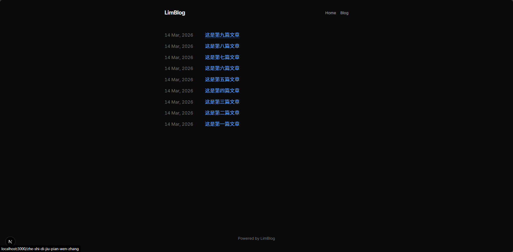
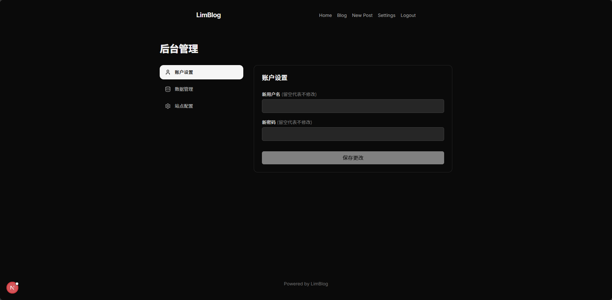

# Bitlog

**Less is More.**

Bitlog 是一个模仿 BearBlog 风格的极简博客系统。它专为热爱写作的人设计，剔除了所有不必要的干扰，提供一个纯粹、安静的创作空间。

本项目已全新重构为 **React SPA (前端) + Go (后端) 前后端分离架构**，在保持原有极简界面与零配置特点的同时，大幅提升了系统的运行性能、响应速度与多平台交叉编译能力。

---

## 🏗️ 架构设计与技术栈

重构后的系统采用现代化、高性能的技术栈：

- **前端 (frontend/)**：基于 **React 19** + **Vite 8** + **TypeScript 6** + **TailwindCSS v4** 构建的现代单页面应用 (SPA)。利用 React Query 进行数据缓存，React Router 7 处理动态路由，实现无刷新的页面切换与极速流畅的交互体验。
- **后端 (backend/)**：基于 **Go 1.25** + **Gin 框架** + **GORM ORM** 实现的高性能 RESTful API 服务。
- **数据库**：使用 **SQLite 嵌入式数据库**。为了支持 `CGO_ENABLED=0` 纯 Go 交叉编译，底层驱动采用纯 Go 实现的 `github.com/glebarez/sqlite`，彻底免除了对宿主机 GCC 编译器的依赖。
- **同源极简部署**：生产环境下，前端编译产物会被打包进 Go 后端的静态资源托管区，由单一 Go 二进制可执行文件完成接口服务、静态托管与附件上传的所有职能。

---

## ✨ 核心特性

- **极简至上**：无广告、无跟踪脚本，极其轻量，页面毫秒级加载。
- **无缝兼容原版数据库**：数据 Schema 与原 Next.js Prisma SQLite 数据库 **100% 兼容**，支持直接替换物理数据库文件进行零成本迁移。
- **强大的编辑器**：
  - 支持全功能 Markdown 语法。
  - **本地图片上传**：支持在编辑器中直接粘贴 (Ctrl+V) 或拖拽图片上传。
  - **智能压缩**：上传图片自动转换为 JPEG 格式并进行等比例缩放（最大宽度 1200px）、CatmullRom 平滑下采样与 80% 质量压缩，GIF 文件原样保留，兼顾画质与加载速度。
  - **安全校验**：内置魔数 (Magic Bytes) 安全校验与后缀清理，防范任意文件上传与恶意脚本执行。
  - **外链视频优化**：完美支持 Bilibili、YouTube 嵌入，自动适配 16:9 比例并默认禁用自动播放。
- **灵活的 Slug 管理**：标题与 URL (Slug) 自动同步，支持手动锁定修改。
- **安全防爆破**：登录接口内置 IP 限流中间件（单个 IP 5分钟内最多允许尝试 5 次，登录成功自动重置计数）。
- **数据自主**：
  - **导入/导出**：支持一键导出所有文章为带元数据的标准 `.md` 文件压缩包。支持一键上传 `.zip` 或单篇 `.md` 批量解析导入。
- **完全隐身模式**：站点可见性可一键切换为“私密模式”，未登录的游客访问前台任何路径都将收到假 404 响应，完美掩护个人后台。

---

## 📸 界面预览

| 🏠 首页 | 📝 撰写文章 |
| :---: | :---: |
|  |  |

| 📚 博客列表 | ⚙️ 站点配置 |
| :---: | :---: |
|  |  |

---

## 📂 项目结构

```text
├── frontend/               # React SPA 前端工程
│   ├── src/                # 前端组件、页面视图、路由上下文
│   ├── public/             # 公共静态资源 (含 favicon.ico)
│   └── vite.config.ts      # Vite 开发代理及配置
├── backend/                # Go 后端工程
│   ├── db/                 # 数据库初始化、SQLite 单例、自动迁移及 Seed
│   ├── handlers/           # 控制器 (文章 CRUD、导入导出、图片上传、配置管理)
│   ├── middleware/         # 中间件 (JWT 会话、IP限流、私密可见性拦截、CORS)
│   ├── models/             # 兼容 Prisma 的 GORM 映射数据模型
│   ├── utils/              # 辅助工具类 (图片裁剪压缩、JWT签名、Zip解析)
│   └── main.go             # Go API 服务入口及 SPA 降级路由托管
├── Dockerfile              # 多阶段构建 Dockerfile
└── docker-compose.yml      # 数据持久化挂载部署文件
```

---

## 🚀 生产部署

### Docker Compose (推荐)

最简单、快捷且保持环境整洁的部署方案。多阶段构建会自动进行前端编译与后端静态编译，并打包进极简的 Alpine 容器运行。

```bash
git clone https://github.com/sunyan7902/Bitlog.git
cd Bitlog
sudo docker compose up -d --build
```

访问 `http://localhost:3456` 即可开始使用。

**持久化与挂载说明：**
- 数据存放在宿主机的本地 `./data` 目录。
- 数据库路径：`./data/bitlog.db`
- 上传图片路径：`./data/uploads/`

---

## 💻 本地开发调试

本地开发需要安装有 [Node.js](https://nodejs.org/) >= 20 和 [Go](https://go.dev/) >= 1.25。

### 1. 运行 Go 后端服务
```bash
cd backend
# 自动下载依赖并启动服务器 (监听端口 3000)
go run main.go
```
启动后，后端会自动检测 `backend/data/bitlog.db` 是否存在，若不存在则会自动建表并向其中注入默认管理员。

### 2. 运行 React 前端服务
```bash
cd frontend
npm install
npm run dev
```
前端服务启动于 `http://localhost:5173`。Vite 已配置开发代理，会自动将 `/api` 和 `/uploads` 路由无缝请求转发至 `http://localhost:3000` 调试。

---

## 🔐 管理后台说明

前台页面不提供明显的登录入口，以保持极简与视觉统一。

- **登录地址**：`/login`
- **默认账号**：`admin`
- **默认密码**：`123456`

> [!IMPORTANT]
> 部署成功后，请第一时间在 **设置 -> 账户设置** 中修改默认账号及密码以确保安全。
> 
> 默认部署为**公开模式**，若只想用作个人私密记事本，可在 **站点配置** 中将“博客可见性”修改为“私密模式”，届时系统将向前台所有访问返回 **404 Not Found** 以实现完美隐身。

---

## 📜 许可

本项目基于 MIT 协议开源。

**Powered by [Bitlog](https://github.com/sunyan7902/Bitlog)**
